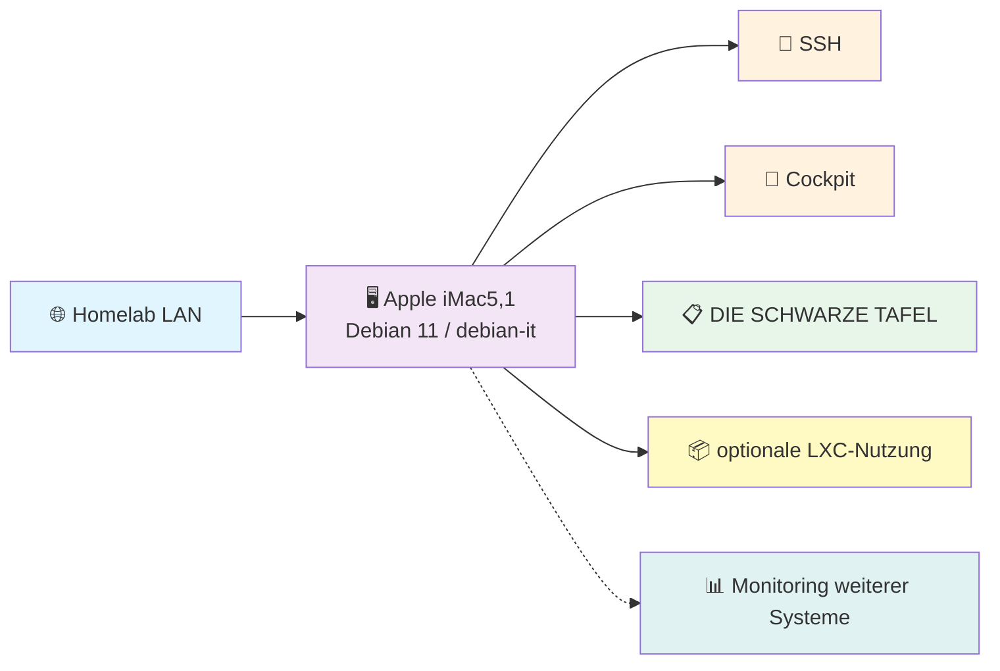

# 🖥️ iMac5,1 Homelab-Server

**Letzte Aktualisierung:** 2026-09-17 | **Maintainer:** [@Hoinkkoma](https://github.com/Hoinkkoma)

Dokumentation des Apple iMac5,1 als schlanker Debian-Server im Homelab. Dieses Repository beschreibt Hardware, Installation, Netzwerk, Dienste, Sicherheit und den laufenden Betrieb an einem zentralen Ort.

---

## 🚀 Quick Start

| 🎯 Bereich | 📖 Link | 🔧 Kurzbeschreibung |
|:---:|---|---|
| **🐧 Debian-System** | [`Debian/`](./Debian/) | Installation, Optimierung und Systembetrieb |
| **🖥️ Server** | [`servers/imac5,1/`](./servers/imac5,1/) | Hardwareprofil und iMac-spezifische Anleitungen |
| **🌐 Netzwerk** | [`Netzwerk/`](./Netzwerk/) | Ethernet, LXC, Tailscale und Diagnose |
| **⚙️ Dienste** | [`Dienste/`](./Dienste/) | SSH, Cockpit, Dashboard und optionale Dienste |
| **🔒 Sicherheit** | [`Sicherheit/`](./Sicherheit/) | SSH-Härtung, Secrets, Updates und Backup |
| **🔧 Wartung** | [`Wartung/`](./Wartung/) | Checklisten, Backups und regelmäßige Aufgaben |
| **🛠️ Fehlerbehebung** | [`Fehlerbehebung/`](./Fehlerbehebung/) | Diagnose und Wiederherstellung |
| **📜 Skripte** | [`scripts/`](./scripts/) | Kleine Hilfs- und Prüfskripte |

---

## 🏗️ Infrastruktur-Übersicht



## 🧾 Systemprofil

| Gerät | Typ | Spezifikation | Funktion | Status |
|---|---|---|---|---|
| **Apple iMac5,1** | Debian-Server | Core 2 Duo T7400, 2 GB RAM, 232.9 GiB Disk | Remote-Administration, leichte Dienste, Statusanzeige | In Entwicklung |

Private IP-Adressen, MAC-Adressen und Zugangsdaten werden nicht in diesem Repository veröffentlicht.

## 📁 Dokumentationsaufbau

```text
Debian/              Betriebssystem, Installation und Optimierung
servers/imac5,1/     Gerätespezifische Dokumentation
Netzwerk/            Netzwerk, LXC und Tailscale
Dienste/             SSH, Cockpit, Dashboard und Services
Sicherheit/           Zugriffsschutz, Secrets und Updates
Wartung/              Regelmäßige Checks und Backup
Fehlerbehebung/       Diagnose und Recovery
assets/               Diagramme und weitere Ressourcen
scripts/              Wiederverwendbare Hilfsskripte
```

Die ursprünglichen englisch benannten Verzeichnisse (`network/`, `operations/`, `security/`) bleiben als Kompatibilitätsreferenz bestehen. Neue Inhalte werden in den kategorisierten Verzeichnissen gepflegt.

## ✅ Grundregeln

- **bestätigt**: Zustand wurde geprüft oder im Projektverlauf dokumentiert
- **geplant**: gewünschter, noch nicht vollständig umgesetzter Zustand
- **prüfen**: alte Angabe; vor Änderungen erneut verifizieren
- Keine privaten IPs, MACs, Passwörter, Tokens oder privaten Schlüssel committen.
- Vor Änderungen zuerst `hostnamectl`, `uname -a`, `free -h`, `lsblk` und `ip addr` prüfen.

## 🤝 Beitragen

Änderungen bitte nachvollziehbar dokumentieren. Für neue Themen zuerst einen Issue anlegen und bei größeren Änderungen die betroffenen Betriebsanleitungen aktualisieren.

Weitere Informationen: [`CONTRIBUTING.md`](./CONTRIBUTING.md)

---

**Status:** 🟡 In Entwicklung | **Letztes Update:** 2026-09-17
