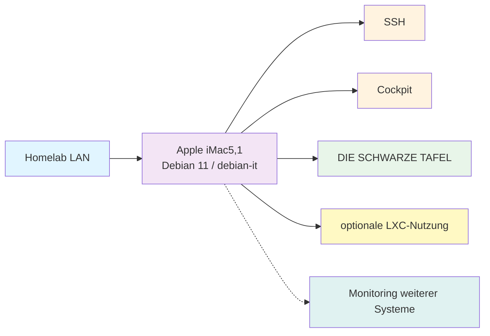

# iMac5,1 Homelab-Server

**Letzte Aktualisierung:** 2026-09-17 | **Maintainer:** [@Hoinkkoma](https://github.com/Hoinkkoma)

Moin Moin Leude, schön, dass ihr hier seid. In diesem Repository dokumentiere ich den Apple iMac5,1 als schlanken Debian-Server für mein Homelab. Hier findet ihr Informationen zur Hardware, Installation, Netzwerk, Diensten, Sicherheit und zum laufenden Betrieb.

---

## Quick Start

| Bereich | Link | Kurzbeschreibung |
|:---:|---|---|
| **Debian-System** | [`Debian/`](./Debian/) | Installation, Optimierung und Systembetrieb |
| **Server** | [`servers/imac5,1/`](./servers/imac5,1/) | Hardwareprofil und iMac-spezifische Anleitungen |
| **Netzwerk** | [`Netzwerk/`](./Netzwerk/) | Ethernet, LXC, Tailscale und Diagnose |
| **Dienste** | [`Dienste/`](./Dienste/) | SSH, Cockpit, Dashboard und optionale Dienste |
| **Sicherheit** | [`Sicherheit/`](./Sicherheit/) | SSH-Härtung, Secrets, Updates und Backup |
| **Wartung** | [`Wartung/`](./Wartung/) | Checklisten, Backups und regelmäßige Aufgaben |
| **Fehlerbehebung** | [`Fehlerbehebung/`](./Fehlerbehebung/) | Diagnose und Wiederherstellung |
| **Skripte** | [`scripts/`](./scripts/) | Kleine Hilfs- und Prüfskripte |

---

## Infrastruktur-Übersicht



## Systemprofil

| Gerät | Typ | Spezifikation | Funktion | Status |
|---|---|---|---|---|
| **Apple iMac5,1** | Debian-Server | Core 2 Duo T7400, 2 GB RAM, 232.9 GiB Disk | Remote-Administration, leichte Dienste, Statusanzeige | In Entwicklung |

Private IP-Adressen, MAC-Adressen und Zugangsdaten werden nicht in diesem Repository veröffentlicht.

## Dokumentationsaufbau

```text
Debian/              Betriebssystem, Installation und Optimierung
servers/imac5,1/     Gerätespezifische Dokumentation
Netzwerk/            Netzwerk, LXC und Tailscale
Dienste/             SSH, Cockpit, Dashboard und Services
Sicherheit/          Zugriffsschutz, Secrets und Updates
Wartung/             Regelmäßige Checks und Backup
Fehlerbehebung/      Diagnose und Recovery
assets/              Diagramme und weitere Ressourcen
scripts/             Wiederverwendbare Hilfsskripte
```

Die ursprünglichen englisch benannten Verzeichnisse (`network/`, `operations/`, `security/`) bleiben als Kompatibilitätsreferenz bestehen. Neue Inhalte werden in den kategorisierten Verzeichnissen gepflegt.

## Gelesen und beachtet

Wenn ihr an diesem Repository mitarbeitet, geht bitte zuerst die vorhandene Dokumentation durch. Änderungen sollen nachvollziehbar bleiben und keine unnötigen Risiken für den Server verursachen.

- **bestätigt** bedeutet: Der Zustand wurde geprüft oder im Projektverlauf dokumentiert.
- **geplant** bedeutet: Der Zustand ist gewünscht, aber noch nicht vollständig umgesetzt.
- **prüfen** bedeutet: Die Angabe stammt aus einem älteren Stand und muss vor Änderungen erneut verifiziert werden.
- Private IPs, MACs, Passwörter, Tokens und private Schlüssel gehören nicht in dieses Repository.
- Vor Änderungen bitte zuerst `hostnamectl`, `uname -a`, `free -h`, `lsblk` und `ip addr` ausführen.
- Für neue Themen bitte zuerst einen Issue anlegen.
- Bei größeren Änderungen müssen die betroffenen Betriebsanleitungen aktualisiert werden.

Weitere Informationen findet ihr in [`CONTRIBUTING.md`](./CONTRIBUTING.md).

---

**Status:** In Entwicklung | **Letztes Update:** 2026-09-17
