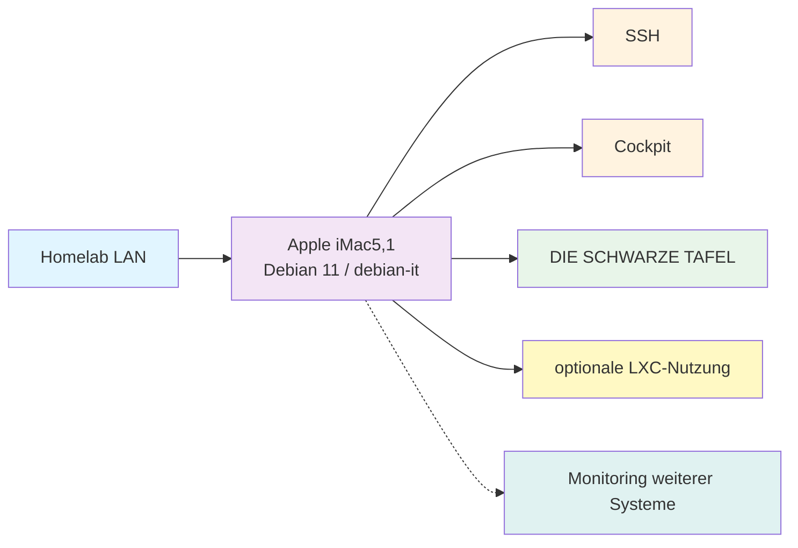

# iMac5,1 Homelab-Server

**Letzte Aktualisierung:** 2026-09-17  
**Maintainer:** [@Hoinkkoma](https://github.com/Hoinkkoma)

Moin Moin Leude, schön, dass ihr hier seid. Dieses Repository dokumentiert meinen Apple iMac5,1 als schlanken Debian-Server für das Homelab.

Die Dokumentation ist nach Aufgabenbereichen aufgebaut: System, Server, Netzwerk, Dienste, Sicherheit, Wartung und Fehlerbehebung.

---

## Inhaltsübersicht

| Bereich | Inhalt | Einstieg |
|---|---|---|
| System | Debian, Installation und Optimierung | [`Debian/`](./Debian/) |
| Server | Hardware und iMac-spezifische Anleitungen | [`servers/imac5,1/`](./servers/imac5,1/) |
| Netzwerk | Ethernet, LXC, Tailscale und Diagnose | [`Netzwerk/`](./Netzwerk/) |
| Dienste | SSH, Cockpit, Dashboard und optionale Dienste | [`Dienste/`](./Dienste/) |
| Sicherheit | Zugriffsschutz, Secrets, Updates und Backup | [`Sicherheit/`](./Sicherheit/) |
| Wartung | Prüfungen und regelmäßige Aufgaben | [`Wartung/`](./Wartung/) |
| Fehlerbehebung | Diagnose und Wiederherstellung | [`Fehlerbehebung/`](./Fehlerbehebung/) |
| Hilfsmittel | Skripte und Diagramme | [`scripts/`](./scripts/) · [`assets/`](./assets/) |

## Infrastruktur-Übersicht



Eine bearbeitbare Version des Diagramms liegt zusätzlich unter [`assets/architecture.mmd`](./assets/architecture.mmd).

## Systemprofil

| Gerät | Typ | Spezifikation | Aufgabe | Status |
|---|---|---|---|---|
| Apple iMac5,1 | Debian-Server | Intel Core 2 Duo T7400, 2 GB RAM, ca. 232,9 GiB Disk | Remote-Administration, leichte Dienste und Statusanzeige | In Entwicklung |

| Systemstand | Wert |
|---|---|
| Betriebssystem | Debian GNU/Linux 11 (Bullseye) |
| Kernel | `5.10.0-32-amd64` (zuletzt dokumentiert) |
| Architektur | `x86_64` |
| Hostname | `debian-it` |
| Netzwerkinterface | `enp2s0` |
| Systemziel | `multi-user.target` |

Private IP-Adressen, MAC-Adressen, Passwörter, Tokens und private Schlüssel werden nicht veröffentlicht.

## Dokumentationsstruktur

```text
README.md                    Einstieg und Gesamtübersicht
Debian/                      Betriebssystem und Systemgrundlagen
servers/imac5,1/             Hardware und konkrete Server-Anleitungen
  README.md                   Geräteübersicht
  installation.md             Installation
  optimization.md             Ressourcenoptimierung
  services.md                 Dienste
  ssh.md                      SSH-Fernverwaltung
  wake-on-lan.md              Wake-on-LAN
  lxc.md                      LXC
  dashboard.md                DIE SCHWARZE TAFEL
Netzwerk/                     Netzwerk und Diagnose
Dienste/                      Dienstübersicht
Sicherheit/                   Sicherheitsregeln
Wartung/                      Wartung und Backups
Fehlerbehebung/               Fehleranalyse und Recovery
assets/                       Diagramme
scripts/                      Hilfsskripte
CHANGELOG.md                  Änderungshistorie
CONTRIBUTING.md               Regeln für Beiträge
```

Die älteren Verzeichnisse `network/`, `operations/` und `security/` bleiben vorerst als Kompatibilitätsreferenz bestehen. Neue Inhalte gehören in die deutsch benannten Bereiche oben.

## Arbeitsablauf

1. **Orientieren:** Die passende Bereichs-README und die betroffene Server-Anleitung lesen.
2. **Prüfen:** Den aktuellen Zustand des iMacs direkt am System verifizieren.
3. **Ändern:** Eine kleine, nachvollziehbare Änderung durchführen.
4. **Testen:** Dienst, Netzwerk und Ressourcenverbrauch kontrollieren.
5. **Dokumentieren:** Anleitung und bei größeren Änderungen den `CHANGELOG.md` aktualisieren.

## Grundregeln

- **bestätigt:** Zustand wurde geprüft oder im Projektverlauf dokumentiert.
- **geplant:** Zustand ist gewünscht, aber noch nicht vollständig umgesetzt.
- **prüfen:** Angabe stammt aus einem älteren Stand und muss erneut verifiziert werden.
- Vor Änderungen zuerst ausführen:

  ```bash
  hostnamectl
  uname -a
  free -h
  lsblk
  ip addr
  ```

- Keine privaten IPs, MACs, Passwörter, Tokens oder privaten Schlüssel committen.
- Für neue Themen zuerst einen Issue anlegen.
- Bei größeren Änderungen die betroffenen Betriebsanleitungen aktualisieren.

Weitere Informationen stehen in [`CONTRIBUTING.md`](./CONTRIBUTING.md).

---

**Status:** In Entwicklung  
**Letztes Update:** 2026-09-17
